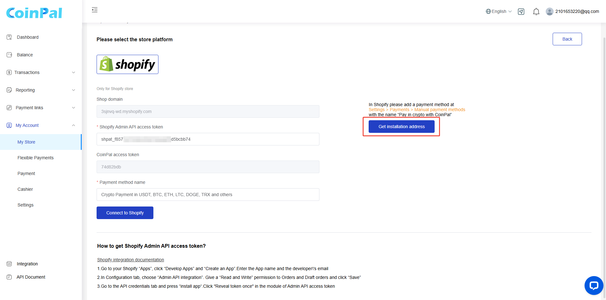
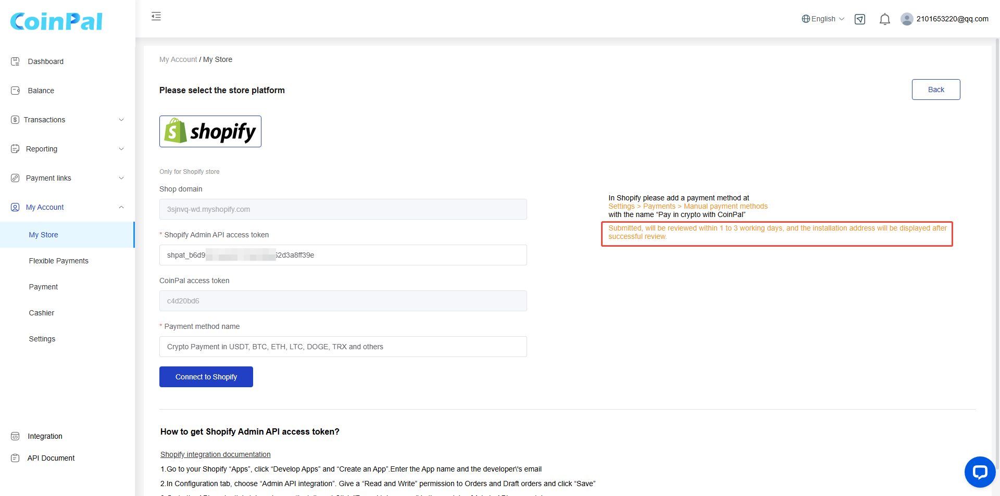
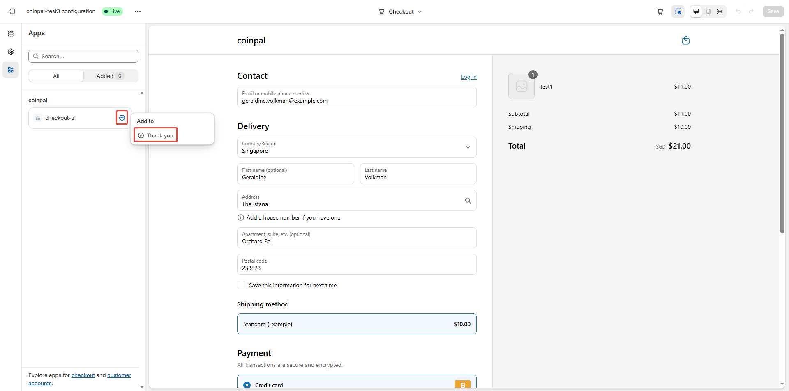

# How to start accepting crypto on Shopify

## Step 1: Go to your Shopify "Apps", click "Develop Apps" and "Create an App". Enter the App name and the developer's email

## Step 2: In Configuration tab, choose "Admin API integration". Give a "Read and Write" permission to Orders and Draft orders and click "Save"

## Step 3: Go to the API credentials tab and press "install app". Click "Reveal token once" in the module of Admin API access token

## Step 4: Go to your [CoinPal Account](https://portal.coinpal.io/#/admin/myAccount/Business) > My Account > My Store > choose/add store & click "Configuration" > click"Shopify" and fill the fields using the info from the Shopify API credentials tab (access token)

## Step 5: Click "Connect to Shopify"

## Step 6: Contact the administrator to obtain the distribution address
    Contact info:
    
    Email: tech@coinpal.io
    
    Telegram: @carter_crypto
    
    Click Install
 

## Step 7: Add Coinpal application in the custom template

## Step 8: Go to Shopify Settings > Payment Providers > Manual Payment Methods. Add a Custom payment method, ensure the Custom payment method name is the same as the one you set in the CoinPal > My Account  > My Store > Payment method name.Then activate it.

## Step 9: Go to Shopify Settings>Notifications>Order confirmation

    Click "Edit code"
    

    Replace the "Thank you for your purchase!" with the following code
     
        Thank you for your purchase!
     
        Thank you for your order!
     
    

    Replace the "We're getting your order ready to be shipped. We will notify you when it has been sent." with the following code
     
        We're getting your order ready to be shipped. We will notify you when it has been sent.
     
        You can continue to pay by clicking &quot;View your order&quot; below
     
     

